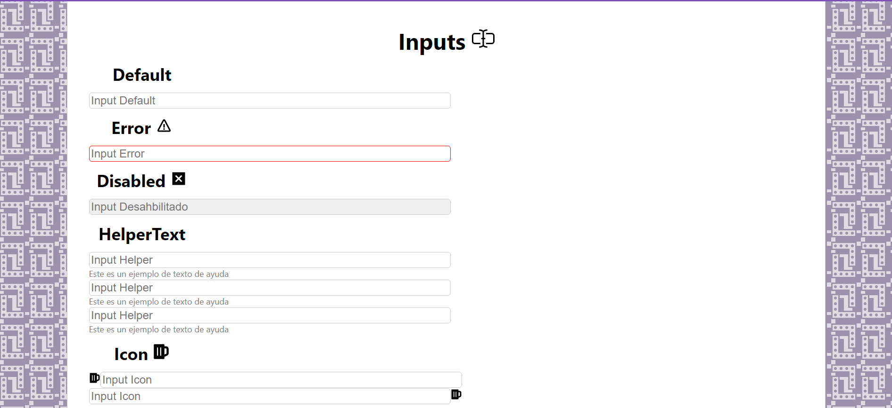

<div align="center">
      <h1> <br/>Input Component</h1></div>

<div align="center">
   solución para el  challenge de  <a href="http://devchallenges.io" target="_blank">Devchallenges.io</a>.
</div>

## Descripción
Este es un proyecto que permite crear una serie de botones a partir de un componente principal. Fue creado como solución a un desafío en DevChallenges.io.

<div align="center">
  <h3>
    <a href="https://input-component-silk.netlify.app/">
      Demo
    </a>
    <span> | </span>
    <a href="https://devchallenges.io/challenges/TSqutYM4c5WtluM7QzGp">
      Challenge
    </a>
  </h3>
</div>




### Built With
     

      

## Características
Este programa cuenta con la siguiente lista de características:

- La opción de ver el estado de error.
- La opción de deshabilitar la entrada de datos.
- La opción de tener texto de ayuda.
- La opción de tener un icono a la izquierda o derecha 
- Diferentes tamaños de entrada disponibles.
- Diferentes colores disponibles.
- La opción de hacer que la entrada ocupe el ancho del elemento padre.
- La opción de tener entrada multilínea como una caja de texto.
- Indicadores visuales disponibles al pasar el cursor por encima o enfocar la entrada.
- Acceso a todos los atributos de entrada logrando modificar un propio input 


## Como Instalar de manera Local
Para clonar y ejecutar esta aplicación, necesitará [Git](https://git-scm.com) y [Node.js](https://nodejs.org/en/download/) (que viene con [ npm](http://npmjs.com)) instalado en su computadora. Desde su línea de comando:

```bash
# Clone this repository
$ git clone https://github.com/pipetboy2001/...

# Install dependencies
$ npm install

# Run the app
$ npm start
```
## Mi experencia en este challange
Este fue un desafío muy interesante, ya que me permitió aprender a crear componentes en React, además de aprender a usar los props y los estados. También me permitió aprender a usar el paquete de iconos de React, que me pareció muy útil ademas de ser el proyecto desplegado por netlify.
